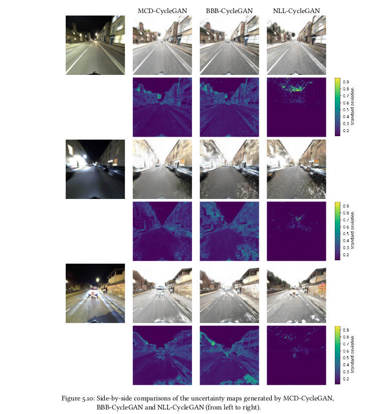

# Uncertain ToDayGAN

This is an extension to [Asha Anoosheh's](https://github.com/aanoosheh) [ToDayGAN](https://github.com/aanoosheh/ToDayGAN) with uncertainty estimation. It is built upon [ComboGAN](https://github.com/AAnoosheh/ComboGAN)

The repo features four models:

 - ToDayGAN (the original model)
 - BBB-CycleGAN (The generators are trained with Bayes-by-Backprop)
 - MCD-CycleGAN (Generators with Monte Carlo Dropout)
 - NLL-CycleGAN (Reconstruction loss with negative log-likelihood)
 
 
 
 The models can be trained and evaluated on images from the Oxford RobotCar night dataset by calling the following files:
 
 - `train_BBB.py`, `test_BBB.py`
 - `train.py` with Dropout > 0, `test_MC_Dropout.py`
 - `train_NLL.py`, `test_NLL.py`


## Installation

Setup a conda environment with CUDA 10, cudnn>=7.6, **Python3.8** and then install requisite Python libraries with `python3 -m pip install requirements.txt`

### Training and testing
Running scripts for training and testing of all models can be found in the `scripts` directory.
For example in `scripts/train_bbb.sh`:

```bash
python train_BBB.py --dataroot ./datasets/robotcar \
  --name robotcar_BBB_kl_0_001 \
  --n_domains 2 \
  --niter 75 \
  --niter_decay 75 \
  --loadSize 512 \
  --fineSize 384 \
  --checkpoints_dir "/net/skoll/storage/datasets/robotcar/robotcar/todaygan_new/bbb_150/kl/0.001" \
  --kl_beta 0.001
```

One of the pretrained models for the ToDayGAN can be found [here](https://www.dropbox.com/s/mwqfbs19cptrej6/2DayGAN_Checkpoint150.zip?dl=0). 
Place it under `./checkpoints/robotcar_<yourname>` and test it with `--name <robotcar_yourname>`.

The `dataroot/` can contain four subfolders `train0`, `train1`, `test0` and `test1`. Where `0` ìs the day-domain and `1` the night-domain. 
The train.py-scripts use the trainX folders.

During training, checkpoints will be saved by default to `./checkpoints/<experiment_name>/`
The test results are exported to `./results/<experiment_name>/<epoch_number>` by default.

### NetVLAD image-based retrieval

All models can be evaluated on the night-images of the visuallocalization benchmark by performing an image-based retrieval.
This repository contains a version of NetVLAD extracted from [S2DHM](https://github.com/germain-hug/S2DHM).
The `test*.py` files accept a `--netvlad` flag. If the following three files can be found, then the python scripts outputs pose predictions in form of a txt-file which can be uploaded directly to the visuallocalization servers.
The three files can be downloaded here. You only have to place them into a suitable directory and set the flags right:

 - [NetVLAD checkpoint](https://pollithy.com/MA/netvlad/checkpoint.pth.tar): The `.tar` weights of the neural network. `--netvlad_checkpoint`
 - [reference descriptors](https://pollithy.com/MA/netvlad/reference_descriptors.tsv): The `.tsv` global descriptors of the database images of the Oxford Robotcar Dataset created with the NetVLAD checkpoint. `--netvlad_ref_descr`
 - [pca transformation](https://pollithy.com/MA/netvlad/pca.pkl ): The `.pkl` pickle-dumped, non-deterministic PCA transformation trained on the reference descriptors. ``--netvlad_pca_dump``

Note: The PCA is not neccessary if you set the following parameter: `--no_pca`. 
You can create your own reference_descriptors with the code in S2DHM.

### NLL-CycleGAN testing parameters

- `--blur`: Blur uncertain regions before localization
- `--blur_thresh`: Which pixels to blur depends on their uncertainty value
- `--blur_dilat_size`: The uncertain pixels are dilated in order to fill gaps
- `--blur_gauss_size` and `--blur_gauss_sigma` parameters of the blurring

### MCD-CycleGAN and BBB-CycleGAN testing params

The test scripts for these models perform multiple variations of the retrieval. One of the options is `--mahala` which activates the calculation and matching with the mahalanobis distance. Be aware that depending on the sample size `--monte_carlo_samples` this might take a while.


## Training/Testing Details
- Flags: see `options/train_options.py` for training-specific flags; see `options/test_options.py` for test-specific flags; and see `options/base_options.py` for all common flags.
- Dataset format: The desired data directory (provided by `--dataroot`) should contain subfolders of the form `train*/` and `test*/`, and they are loaded in alphabetical order. (Note that a folder named train10 would be loaded before train2, and thus all checkpoints and results would be ordered accordingly.) Test directories should match alphabetical ordering of the training ones.
- CPU/GPU (default `--gpu_ids 0`): set`--gpu_ids -1` to use CPU mode; set `--gpu_ids 0,1,2` for multi-GPU mode.
- Visualization: during training, the current results and loss plots can be viewed using two methods. First, if you set `--display_id` > 0, the results and loss plot will appear on a local graphics web server launched by [visdom](https://github.com/facebookresearch/visdom). To do this, you should have `visdom` installed and a server running by the command `python -m visdom.server`. The default server URL is `http://localhost:8097`. `display_id` corresponds to the window ID that is displayed on the `visdom` server. The `visdom` display functionality is turned on by default. To avoid the extra overhead of communicating with `visdom` set `--display_id 0`. Secondly, the intermediate results are also saved to `./checkpoints/<experiment_name>/web/index.html`. To avoid this, set the `--no_html` flag.
- Preprocessing: images can be resized and cropped in different ways using `--resize_or_crop` option. The default option `'resize_and_crop'` resizes the image such that the largest side becomes `opt.loadSize` and then does a random crop of size `(opt.fineSize, opt.fineSize)`. Other options are either just `resize` or `crop` on their own.

